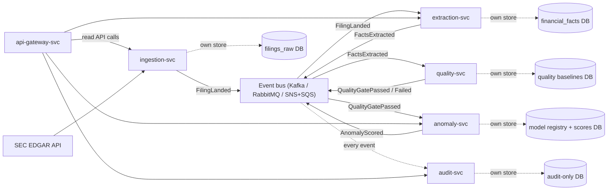

# Reference design: a microservice decomposition of this system

**This was never built.** Nothing in this document describes code that
exists in this repository or ever has. It is a comparative architecture
sketch — the kind of thing a public engineering blog publishes to explain a
decision ("here's the design we didn't pick, and why") — written so the
monolith decision in
[`docs/DECISION_LOG.md`](DECISION_LOG.md) §0 has a concrete alternative to
be compared against, instead of an assertion taken on faith. If you're
using this project's history in an interview: the honest claim is "I
designed a microservice decomposition of this system, sketched it out, and
chose a modular monolith instead — here's why," not "we built microservices
and migrated away." The former is what this document supports.

Style and scope modeled on the public architecture write-ups engineering
orgs publish for exactly this purpose (see the pattern surveyed at
[github.com/topics/microservice-example](https://github.com/topics/microservice-example)):
a service map, per-service ownership and contracts, a deployment sketch, and
— the part those posts don't always include but should — a rejection
rationale grounded in specific, evidenced failure modes rather than generic
"microservices don't scale for small teams" hand-waving.

---

## 1. Service map



Seven deployables where this repository has one: five domain services, an
API gateway, and a message bus (or, in the orchestration-preserved variant
in §4, Airflow calling out to five services' HTTP APIs instead of a bus).

## 2. Per-service ownership

Each service owns exactly one slice of data and exposes it only through its
own API or events — "database per service," the core tenet that actually
defines a microservice architecture as opposed to a monolith split across
processes for no reason. No service reads another's tables directly.

| Service | Responsibility (maps to this repo's) | Owns | Publishes | Consumes |
|---|---|---|---|---|
| **ingestion-svc** | `src/edgar_client.py` | `filings_raw` | `FilingLanded` | — (polls SEC EDGAR) |
| **extraction-svc** | `src/xbrl_parser.py` | `financial_facts` | `FactsExtracted` | `FilingLanded` |
| **quality-svc** | `src/quality.py` | rolling PSI baselines | `QualityGatePassed` / `QualityGateFailed` | `FactsExtracted` |
| **anomaly-svc** | `src/ml/`, model registry | `model_runs`, `fact_anomalies`, model artifacts | `AnomalyScored` | `QualityGatePassed` |
| **audit-svc** | the not-yet-built `extraction_audit` (see [`AUDIT_TRAIL_PLAN.md`](AUDIT_TRAIL_PLAN.md)) | `pipeline_audit`, `extraction_audit` | — | *every* event above |
| **api-gateway-svc** | `api/main.py` | nothing of its own | — | reads from the others' query APIs |

**API contracts**, sketched at the level a real design doc would pin down
before writing code (request/response shapes, not implementations):

```
ingestion-svc
  POST /ingest/{cik}                     trigger a fetch
  GET  /filings/{accession}/raw          fetch landed HTML (internal-only)

extraction-svc
  GET  /facts/{accession}                 parsed facts for one filing
  GET  /facts?ticker={t}&fact={name}      time-series (backs the public API)

quality-svc
  GET  /quality/{run_id}                  completeness + PSI result for a run

anomaly-svc
  GET  /anomalies/{accession}             latest score + reasons
  GET  /models/current                    promoted model provenance
  POST /score/{accession}                 on-demand scoring

audit-svc
  GET  /audit/{accession}                 full extraction history
  GET  /audit/verify                      hash-chain integrity check

api-gateway-svc
  (the existing public surface: /filings, /filing/{accession},
   /facts/{ticker}/{fact_name}, /anomalies/{ticker}, /model/current,
   /trigger/{ticker} — each proxied to the owning service above)
```

## 3. Deployment sketch

Illustrative only — this is not a runnable file, and nothing named this
should be added to the repo as if it were:

```yaml
# docker-compose.microservices.example.yml  (sketch — not a real file, not deployable)
services:
  message-bus:        { image: rabbitmq:3-management }
  ingestion-svc:       { build: ./services/ingestion,  depends_on: [ingestion-db, message-bus] }
  ingestion-db:        { image: postgres:16-alpine }
  extraction-svc:      { build: ./services/extraction, depends_on: [extraction-db, message-bus] }
  extraction-db:       { image: postgres:16-alpine }
  quality-svc:         { build: ./services/quality,    depends_on: [quality-db, message-bus] }
  quality-db:          { image: postgres:16-alpine }
  anomaly-svc:         { build: ./services/anomaly,    depends_on: [anomaly-db, message-bus] }
  anomaly-db:          { image: postgres:16-alpine }
  audit-svc:           { build: ./services/audit,      depends_on: [audit-db, message-bus] }
  audit-db:            { image: postgres:16-alpine }   # separate credentials — see §5
  api-gateway-svc:      { build: ./services/gateway,    depends_on: [ingestion-svc, extraction-svc, anomaly-svc, audit-svc] }
  redis:                { image: redis:7-alpine }        # gateway-side cache, as today
```

Six services, five databases (or five schemas with hard credential
separation — the number that matters is *five independent write
boundaries*, not necessarily five physical instances), one message bus, one
cache. Compare to this repository's actual `docker-compose.yml`: two
services (Postgres, Redis), one application codebase.

## 4. The orchestration fork every real microservice write-up has to resolve

Two genuinely different ways to wire these five services together, and a
real design doc has to pick one and defend it — presenting only one option
would be the hand-wavy version of this document:

**(a) Choreography** — no central coordinator. Each service reacts to the
previous service's event on the bus, as diagrammed in §1. Pro: services are
fully decoupled from each other's implementation. Con: the *pipeline*, as a
concept, no longer exists anywhere as a single artifact — it's an emergent
property of five services' independent event handlers, which is exactly
what makes it hard to answer "what state is accession X in right now"
without a dedicated read model (which is, not coincidentally, most of what
audit-svc would have to become).

**(b) Orchestration-preserved** — keep Airflow, but each `PythonOperator`
task calls a service's REST API instead of importing a local module
(`fetch_new_filings` → HTTP call to ingestion-svc, and so on down the
existing 8-task chain). This is the more common real-world pattern when a
team already has Airflow and doesn't want to give up its scheduling and
retry semantics. It also directly reproduces the specific risk this
project's mission statement named as a reason to avoid a service split in
the first place: every task now depends on a service being up, correctly
versioned, and reachable over the network — replacing an in-process
function call (which fails the way Python fails: an exception, a stack
trace, a type) with an HTTP call (which fails the way networks fail:
timeouts, partial responses, a service that's up but serving a
schema-incompatible version, a load balancer returning 200 with a stale
cached error page). `EdgarClient` already has to defend against exactly
this class of failure for one external dependency (SEC EDGAR); this fork
would mean defending against it for five internal ones too.

## 5. What a service split would *actually* buy — argued specifically, not asserted generally

Not every case for microservices here is bad; being honest about the real
one makes the rejection of the rest more credible, not less.

**audit-svc's isolation would be a genuine security improvement over what's
proposed in [`AUDIT_TRAIL_PLAN.md`](AUDIT_TRAIL_PLAN.md).** That plan's
PostgreSQL trigger stops a compromised application credential from issuing
`UPDATE`/`DELETE` against audit rows — but that same credential could still
*author* a fraudulent, well-formed new row, because the extraction workers
and the audit table share one database and one set of credentials. A real
`audit-svc` with its own database, its own write credential that no other
service ever holds, and an API that only accepts new rows (never edits)
would close that remaining gap: compromising an extraction worker would no
longer be sufficient to forge audit history, because the worker never had
audit-write credentials in the first place — it would only ever call
audit-svc's API the same way an external caller would. That's a strictly
stronger boundary than a trigger inside a shared database, and it's the one
place in this whole comparison where the microservice answer is better on
the actual security property, not just organizationally fashionable.

Whether that's worth six services and a message bus to get *one* actually
stronger boundary is the real trade-off — and for this project, at this
scale, the answer below is no. But it's worth recording as the strongest
argument *for* the split, not skipped past.

## 6. Why the monolith was the right call — using this project's own evidence, not general architecture-blog wisdom

Every claim below points at a real defect documented in
[`docs/DECISION_LOG.md`](DECISION_LOG.md), not a hypothetical.

- **§1 (the false-green Airflow-3 incompatibility) was caught by one test in
  one CI job**, because the entire pipeline is one importable module —
  `tests/test_dag_import.py` imports it in a subprocess and that's the whole
  verification surface. In the decomposition above, six services each carry
  their own dependency set and their own compatibility risk; the same class
  of defect (a version bump silently breaking an import path) now needs six
  independent verifications instead of one, and a gap in any single one
  reproduces exactly this bug in that one service.
- **§7 and §8 (backoff jitter, idempotent UPSERTs) were both about implicit
  coordination between retries and writes** — one client, one write path,
  one place to get it right. A message-bus architecture has at-least-once
  delivery semantics by default, which means *every one* of the five
  consumers in §1's diagram needs its own idempotency handling on message
  receipt, on top of (not instead of) the database-level idempotency this
  project already had to build once. Same bug class, five times the surface
  area, not less.
- **§9 (the audit trail) required real, deliberate scoping discipline for
  one codebase** — deciding which stages get instrumented, how the hash
  chain handles concurrent writers, what a trigger can and can't prove. The
  distributed version of the same guarantee (correlation IDs threaded
  through five services, exactly-once semantics for audit-svc despite an
  at-least-once bus, reconciling partial pipeline failures across services
  that don't share a transaction) is a strictly harder version of a problem
  this project already found non-trivial once.
- **Team size is the constraint the general architecture-blog framing
  usually skips.** Six services means six deployment pipelines, six sets of
  dashboards and alerts, and an on-call rotation that has to reason about
  which of six things is down — overhead that pays for itself at an
  organizational scale (independent teams owning independent services,
  genuinely different scaling profiles per component) this project isn't
  at and isn't likely to be at as a personal/portfolio project.

None of this says microservices are wrong in general — §5 names the one
place they'd be a real, specific improvement here. It says they're the
wrong trade for *this* system at *this* scale, and the evidence for that is
the same set of real bugs already documented and fixed once, not a second
time each, across one codebase.
